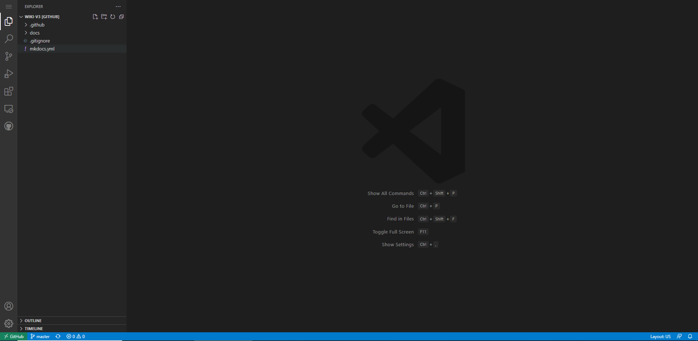
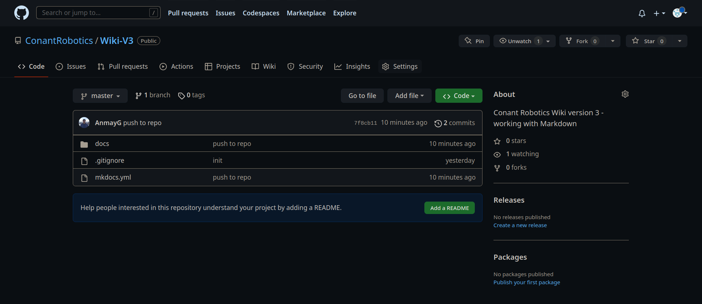
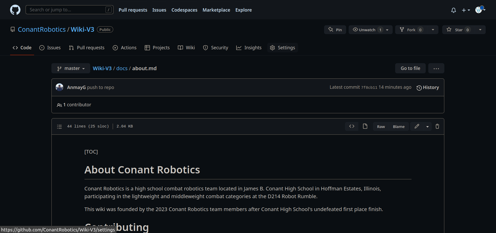

# About

## Who We Are

Conant Robotics is a high school combat robotics team located in James B. Conant High School in Hoffman Estates, Illinois, participating in the lightweight and middleweight combat categories at the D214 Robot Rumble.

This wiki was founded by the 2023 Conant Robotics team members after Conant High School's undefeated first place finish since we knew a lot but didn't teach a lot.  

## Contributing

<a href="https://tenor.com/view/cat-keyboard-typing-twitter-fingers-gif-13146203">Cat Keyboard GIF</a>from <a href="https://tenor.com/search/cat-gifs">Cat GIFs</a>
 

### Sign up for a Github Account

1. Navigate to [www.github.com](https://github.com/).

2. Click the "Sign Up" button in the top right corner and go through the signup process to create your GitHub account.

3. You're done! Go to [https://github.dev/ConantRobotics/Wiki-V3](https://github.dev/ConantRobotics/Wiki-V3) to start editing the website documentation.

### How to Use the GitHub Code Editor

When you visit [https://github.dev/ConantRobotics/Wiki-V3](https://github.dev/ConantRobotics/Wiki-V3), it should look something like this:

This is called an _IDE_, or **I**ntegrated **D**eveloper **E**nvironment, and it's how you can navigate between the files contained within a code project

You can navigate within the file directory on the left to find the file that you want, and even upload images into the **docs/img** directory.

For a tutorial on Markdown (The file format this website utilizes), visit [https://www.markdowntutorial.com/](https://www.markdowntutorial.com/). From there, just open a file and get started on editing the wiki!

### Website Organization

While the website organization is pretty self-explanatory, here it is in writing so nobody screws it up:
- Each `.md` file is a **Markdown** file - a file stored as plain text that then gains basic formatting such as **bolding**, *italicizing*, `code` and more. Wiki articles are written in Markdown format so they can be parsed by the documentation creator [MkDocs](https://squidfunk.github.io/mkdocs-material/) and eventually published on the [website](https://conantrobotics.github.io/Wiki-V3/).

- There are 7 folders, or categories in which articles are published in. These can be seen in the menu bar or in the subfolders of the GitHub repository. Each of the `.md` files in the folders is an article, and more articles can be added to the category by creating a new Markdown file in the folder and referencing it in the `mkdocs.yml` YAML file under that category.

- Just follow the way the rest of the website is made and you'll be following standard documentation conventions - it's hard to mess up so don't worry! Your edits will be reviewed by the coaches/captains anyways, so they'll catch any mistakes that you make.

- Additionally, visit [https://www.w3schools.com/git/git_intro.asp?remote=github](https://www.w3schools.com/git/git_intro.asp?remote=github) to get a brief introduction to GitHub, or just press `Ctrl + Shift + G` then `Create Pull Request` (the second button from the left in the top bar) after writing and making your changes.

- The GitHub account owners can also add you as a contributor, so just ask the coaches or captains if they can add you to streamline the process.

Yes, this all seems a bit complicated, but it gets easier to understand as you go through the process more. If you want a more clearly outlined method to take you step by step, follow the steps below.

### The Old Way (Written before github.dev was created)

<a href="https://tenor.com/view/alex-geerken-geerken-animator-animation-cartoon-gif-16352410">Alex Geerken Geerken GIF</a>from <a href="https://tenor.com/search/alex+geerken-gifs">Alex Geerken GIFs</a>
 

1. Navigate to [the Conant Robotics Repository](https://github.com/ConantRobotics/Wiki-V3). This is the repository that the documentation is based off of.

2. Click on the folder named "docs", then "about.md" until you see a screen like the one below:

3. Click the pencil icon next to "Raw" and "Blame" so you can edit the file. Add your name to the bottom of the file under "Contributors". 
<!-- IMAGE IS TODO -->

4. Now it's time to make some formatting changes to your name. Add two asterisks to the left and right of your name so that it looks like \*\*your name\*\*. If you click on the Preview tab at the top of the page, you can see that your name has been **bolded**. 
<!-- IMAGE IS TODO -->

5. You can also _italicize_  your name by adding underscores (\_) to the left and right of your name. Remove the asterisks next to your name and replace them with underscores so it looks like \_your name\_. If you click on the Preview tab again, your name should be italicized. 
<!-- IMAGE IS TODO -->

6. These modifiers can also be stacked, enabling you to really emphasize _**your name**_. Add the two asterisks back in, this time adding them around the underscores so it looks like \*\*\_your name\_\*\*. Now, your name should be **bolded** and _italicized_ in the Preview tab. 
<!-- IMAGE IS TODO -->

7. After modifying the Contributors section to contain **_your name_**, press the green "Create a pull request" button at the bottom of the page. This will open a request for the Wiki moderator (Mr. Bruce or Mr. LeBlanc) to accept your changes and enter them into the wiki. 

<!-- IMAGE IS TODO -->

8. Then, go back to the top of the page, and click the "docs" under "Wiki-V3/docs/about.md" file structure. This will take you back to the home directory, enabling you to enter the "img" directory containing all of the images. Once you're inside the "img" directory, press "Add Files" -> "Upload Files" and upload any image you have of yourself. This will be the image that goes under your name in the "Contributors section". 
<!-- IMAGE IS TODO -->

9. Finally, go back to "docs/about.md" and add a link to your image under your name by adding **\!\[your name here\]\(/img/yourimagename.png\)**. 
<!-- IMAGE IS TODO -->

10. Create a pull request for your image by click the green "Create a pull request" button. Once your pull request has been accepted, you'll have successfully added your name and image to the Contributors section and are officially ready to begin contributing to the wiki!

## Advanced Contributions

If you're looking at this section, it's assumed that you already:  
- Have a GitHub account with your own coding projects in it  
- Know how to contribute to a GitHub repository without going through the web interface  
- Know how to clone, commit, and pull from a repo.  
- Have promised not to do anything stupid with GitHub that would crash the Wiki.  
- Know how to not do anything stupid with GitHub that would crash the Wiki.
- ~~Know how to quit Vim~~

If you want and know how to, you can clone this repo onto your personal computer and use it to develop on the Wiki. 

I recommend this solution if you're working with images, as it makes it easy to add all of the images into the img folder under a subdirectory. It's also helpful if you are very comfortable in your own IDE (all hail Vim) as it makes typing articles up much easier.

There's no tutorial for this because I'm lazy, but it's good to try it out, especially if you're authoring a completely new article.

## Motivation

This wiki was founded by Anmay Gupta and the rest of the Robotics Club Class of '23 after realizing that none of the underclassmen knew anything about mechanical design and all of the seniors were graduating the next year.

Additionally, the first two months of meetings were often spent reconstructing the work of the past year, leading to consistent "what were the receiver bindings again?" and "how do I bind the receiver" and "why isn't our receiver turning on" and "green goes down, right?" and a whole lot of other questions that aren't related to the receiver I promise.

Moreover, these questions would lead to rediscovery of already known information, such as how power management works for the batteries or how the receiver can be switched from plane mode into tank mode.

That's why this wiki was created: to act as a digital repository of all discovered information because we ~~hate answering obvious questions~~ want to keep the team running efficiently and effectively after we graduate.

## Contributors

_**Anmay Gupta '23, Captain of the 2023 Conant Robotics Team**_  

---
This article authored by Anmay Gupta in March 2023.
