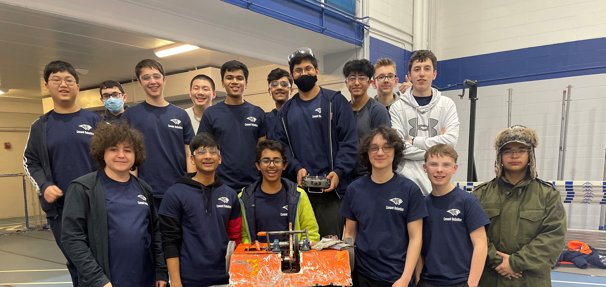

# Competition

Get ready to witness the mind-boggling extravaganza of clunky contraptions and sparks flying everywhere at the D214 Robot Rumble! This annual event brings together the self-proclaimed "brightest minds" in robotics and engineering for a competition that promises more chaos than cohesion. Held in a city teeming with confused onlookers, this two-day spectacle showcases the epitome of questionable innovation and engineering mishaps. Buckle up for a rollercoaster ride of questionable decisions and mechanical marvels gone awry!

## Day 1: The Circus of Cogs and Catastrophes

The first day of the D214 Robot Rumble dawns with a mixed bag of anticipation and confusion. Teams from universities, research institutions, and some questionable garage tinkering enthusiasts assemble to display their so-called "state-of-the-art" robots. The arena itself resembles a cluttered junkyard, complete with last-minute duct tape repairs and hastily printed logos peeling off like bad sunburn. As the opening ceremony commences, it becomes clear that a healthy dose of spectacle is necessary to distract from the impending technological disaster.

The event kicks off with a keynote speech from some guy they pulled off the street, who manages to maintain a straight face while discussing the potential of these glorified RC cars. The crowd politely claps, albeit with a puzzled expression, as the robots stumble onto the arena floor. These mechanical monstrosities struggle to demonstrate their prowess, but mostly end up tangled in their own limbs, frantically beeping for help. It's a captivating sight, indeed, as the audience struggles to comprehend the purpose of these metallic oddities.

The challenges themselves range from mundane tasks like navigating a straight line (which most robots fail spectacularly) to more ambitious endeavors, such as crashing into the other robot in a way that does more than scratch the paint. The audience is treated to a symphony of grinding gears, screeching motors, and the occasional "oops" as a robot accidentally crashes into the wall. Amidst the chaos, it's hard not to feel a mix of pity and amusement for the not-so-diligent engineers who poured their hearts into these charmingly flawed creations. And OSHABot. I mean look at these guys!

## Day 2: The Battle of the Bots (Or Lack Thereof)

As the sun rises on the second day, the atmosphere is filled with a palpable sense of confusion. The robots that miraculously survived the previous day's challenges now face the ultimate test—the Elimination Rounds. The arena is transformed into a makeshift battleground, complete with tinfoil-wrapped "weapons" and plastic shields that fold at the slightest breeze. The audience eagerly awaits the impending clash of these mechanical misfits, hoping for a modicum of entertainment.

The Elimination Rounds, unfortunately, turns out to be more of a slapstick comedy routine than a display of technological prowess. The robots, armed with their "deadly" weapons, engage in a battle that can only be described as a slow-motion, clumsy dance. Their movements resemble a drunk octopus trying to find its way home after a wild night out. The crowd alternates between pitying laughter and sympathetic applause, wondering if they accidentally stumbled into a robot-themed sitcom.

While competition is supposed to be the driving force behind this event, camaraderie and collaboration seem to be the only things holding it together. During breaks, teams gather to share tales of their design disasters and bond over their shared misfortunes. It's a comforting reminder that, despite their questionable creations, these high school enthusiasts are united by their unwavering determination to prove that duct tape and dreams can conquer all.

## Conclusion: Where Scrap Metal Meets Slightly More Scrap Metal

The D214 Robot Rumble is an unparalleled display of ambition, with participants showcasing their questionable creations and pushing the boundaries of what can be considered "functional." Amidst the sparks, tangled wires, and the occasional loud explosion, it's hard not to marvel at the audacity of these individuals. While the event may lack the finesse and technical prowess of more reputable competitions, it serves as a reminder that innovation can arise from the most unexpected places.

So, if you're in the mood for a laugh, a healthy dose of confusion, and an opportunity to appreciate the charmingly flawed nature of human ingenuity, make sure to mark your calendar for the next D214 Robot Rumble. Just be prepared for a spectacle that is more scrap metal than cutting-edge technology. It's an event where sparks fly, dreams collide, and the line between engineering brilliance and utter chaos is delightfully blurred.

And at the end of the day, remember:

## Measure Once, Cut Twice, & Safety Third.

---
This article authored by ChatGPT in May 2023. I originally wanted it to just be a placeholder before I write an actual breakdown of what the competition, but it turned out kinda nice and I'm sentimental about it now.