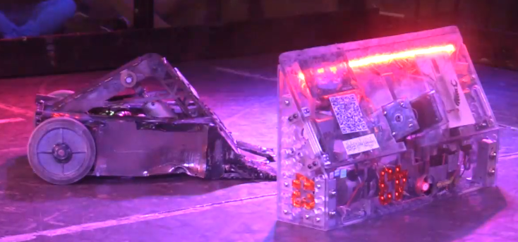

# Differential Drives

Due to it's frequent usage within battlebot competitions, it's important to address the limitations and the functionality of a differential drive in greater detail.

A differential drive is a type of drive system commonly used in robots for its simplicity and maneuverability. This system consists of two independently controlled wheels or tracks, one on each side of the robot. Each wheel is powered by its own motor, which allows the robot to move forward and backward and turn in place by varying the speed and direction of each motor.

The differential drive system works by using the difference in speed between the two wheels to turn the robot. For example, if the robot wants to turn to the left, the motor on the right side of the robot will slow down while the motor on the left side will speed up. This causes the robot to turn to the left as the wheels on the left side move faster than the wheels on the right side.

The differential drive system is easy to implement and provides good control and maneuverability in a variety of environments. It is also relatively efficient and has a low power consumption compared to other drive systems.

However, the differential drive system has some limitations. One major issue is that it can be prone to tipping over if the weight distribution of the robot is not well-balanced. This is because the robot relies on its wheels for stability, and if the weight is not distributed evenly, the robot may tip over when turning or accelerating.

Additionally, a robot with too much weight on one side will have greater traction on that side. This results in the heavy side speeding up much faster than the other side, making the robot much harder to manuever as the robot will overshoot or undershoot turns unpredictably.

<!-- Insert image of Janktality with batteries located on both sides of the weapon. -->

This is the ideal center of mass distribution for a differential drive, as it ensures both wheels have the same traction. That's why supremely tight and fast turns could be taken during battle, opening up multiple methods to counterattack after being rammed into the wall.

<!-- Insert image of Janktality with batteries located on one side of the weapon. -->

This distribution is what was operated the first year of Janktality's operation,

Another limitation of differential drive systems is that they can struggle on uneven or rough terrain. This is because the wheels may lose traction or become stuck on obstacles, making it difficult for the robot to move or turn. This is often resolved by placing casters on the bottom of the robot that can roll over any terrain differences, but it can be compensated for with a skilled driver.

In 2020, Schaumburg's driver was bad (way worse than I am), so they drove over a crack in the arena floor that lifted their robot up slightly, as you can see in the image. This, combined with the gradual dulling of their wedge during the competition, allowed the flipper they were facing to slip their wedge under the robot and easily flip them. If you want to see the full fight, watch the [2020 Robot Rumble video](https://vimeo.com/394635561#t=20270s) at timestamp 5:37:50.

Overall, the differential drive system is a versatile and efficient drive system that is well-suited for many types of robot combat. However, designers must be aware of its limitations and work to ensure the robot's weight distribution and wheel design are optimized for maximum stability and control.

---
This article authored by Anmay Gupta and ChatGPT in March 2023.
