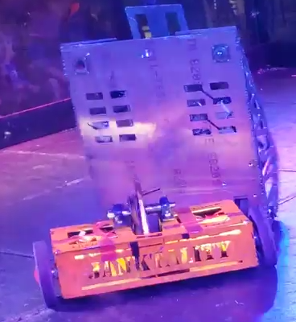

# Drive Systems Intro 

A robot combat drive system is the mechanism that allows a robot to move and control its position and orientation during combat. 
The drive system is the most important part of the robot, as it opens up new possibilities for weapon systems, attacks, and driving manuevers.

## Types of Drive Systems

A robot combat drive system is the mechanism that allows a robot to move and control its position and orientation during combat. 
There are various types of drive systems that can be used for robot combat, each with its own advantages and disadvantages.
Here are some of the most common types of drive systems used in robot combat and how they work:

- Differential Drive: Differential drive is the most common type of drive system used in robot combat. It uses two independently controlled wheels or tracks on each side of the robot, with each wheel or track powered by a separate motor. By varying the speed and direction of each motor, the robot can turn, move forward or backward, and spin in place. Differential drive provides good maneuverability and control, but can be vulnerable to tipping over if the weight distribution is not well-balanced.

<!-- Insert image of Janktality internals here -->

Janktality used a differential drive system due to its simplicity and manueverability, enabling it to run circles around its opponents in the final competition.

- Differential Drive with Casters: This is the same basic concept as a differential drive, but it utilizes two additional wheels in the front of the robot to reduce scraping on the arena floor. By using these additional wheels, the robot is able to better traverse uneven terrain (such as a torn-up arena floor) and often has improved control. However, it's extremely difficult to create a wedge using this drive system, as a wedge needs to scrape the floor in order to be effective. As such, this method is often used on very long or wide robots that "sag" in the center, using the two caster wheels to lift the center back up.

 

Spatula, a hydraulic flipper, used two ball casters under its wedge to prevent the wedge from scraping the ground and reducing manueverability. There's only one in the picture as we knocked off the other one.

- Tank Treads: Tank treads are a type of drive system that use continuous tracks on each side of the robot, similar to those used on tanks. They provide good traction and stability, making them ideal for robots that need to traverse rough terrain or obstacles. However, they are typically slower and less maneuverable than other types of drive systems, resulting in them being rarely used in the Robot Rumble.

<!-- Insert image of some tracked robot here -->

- Omni-Directional Drive: Omni-directional drive systems use three or more wheels or rollers arranged in a specific pattern to provide the robot with the ability to move in any direction, rotate around its own axis, and move sideways. These systems provide excellent maneuverability and speed, but can be more complex and expensive to build. They are rarely used in the Robot Rumble due to their high weight and lack of power delivery when ramming other robots.

<!-- Insert image of some full-body spinner here (NOT A MELTY BRAIN) -->

- Four-Wheel Drive: Four-wheel drive systems use four independently controlled wheels to provide the robot with greater stability and traction than a two-wheel drive system. By controlling the speed and direction of each wheel, the robot can turn, move forward or backward, and spin in place. Four-wheel drive systems are typically more stable and maneuverable than two-wheel drive systems, but due to their weight are not used within the Robot Rumble.

<!-- Insert image of some four-wheeled robot here  -->

- Hybrid Drive: Hybrid drive systems combine two or more types of drive systems, such as differential drive and tank treads or omni-directional drive and four-wheel drive. These systems offer the benefits of each type of drive system, but can be more complex and difficult to control. The most common usage of these drives is in the creation of custom geartrains, as some robots will use tracks as a method of gear reduction.

<!-- Insert image of a wide polycarbonate robot from Hersey in RR2023 as they were using a system similar to this -->

In addition to the type of drive system used, the motors and controllers used to power and control the robot's movement are also important. High-quality, durable motors and controllers are essential for providing the robot with the power and precision it needs to navigate the battlefield and outmaneuver its opponents. The drive system and motors should be designed to work in harmony with the robot's other systems, such as its weapon and control systems, to provide an effective and efficient combat robot.

---
This article authored by Anmay Gupta and ChatGPT in March 2023.
